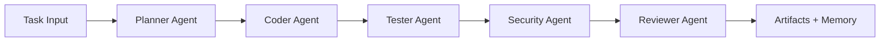

# Enterprise AI CodeOps Multi-Agent System

Enterprise-style multi-agent coding pipeline inspired by production engineering workflows.

This project orchestrates specialized agents to turn a feature request into:
- an implementation draft
- a test plan and test skeleton
- a security audit report
- a final reviewer summary

It is designed to demonstrate strong software engineering signals for hiring portfolios:
- deterministic orchestration
- explicit reasoning steps
- quality and security gates
- reusable graph nodes
- testable architecture

## Why This Repo Stands Out

- **Multi-agent architecture with clear responsibilities** (`Planner`, `Coder`, `Tester`, `Security`, `Reviewer`)
- **Deterministic composition**: each step is reproducible and easy to debug
- **Memory layer**: stores historical runs for traceability
- **Production-ready repo hygiene**: CI, templates, contribution docs, and security policy

## Architecture



Detailed design: [docs/ARCHITECTURE.md](docs/ARCHITECTURE.md)

## Quickstart

### 1. Clone and enter repo

```bash
git clone <your-repo-url>
cd "Enterprise AI CodeOps Multi-Agent System"
```

### 2. Create virtual environment

```bash
python -m venv .venv
# Windows
.venv\Scripts\activate
# macOS/Linux
source .venv/bin/activate
```

### 3. Install dependencies

```bash
pip install -e .[dev]
```

### 4. Run the pipeline

```bash
python -m codeops_mas.cli ^
  --task "Build a FastAPI endpoint for ride fare estimation" ^
  --stack "FastAPI,Pydantic,Redis" ^
  --constraints "latency<120ms,include unit tests" ^
  --output "artifacts/demo_run"
```

macOS/Linux:

```bash
python -m codeops_mas.cli \
  --task "Build a FastAPI endpoint for ride fare estimation" \
  --stack "FastAPI,Pydantic,Redis" \
  --constraints "latency<120ms,include unit tests" \
  --output "artifacts/demo_run"
```

## Example Output

Each run generates:
- `00_plan.md`
- `01_solution.py`
- `02_tests.py`
- `03_security_report.md`
- `04_review.md`

Run history is appended to `artifacts/memory/history.jsonl`.

## Project Structure

```text
Enterprise AI CodeOps Multi-Agent System/
├─ .github/
│  ├─ workflows/ci.yml
│  ├─ ISSUE_TEMPLATE/
│  └─ pull_request_template.md
├─ docs/
├─ src/codeops_mas/
│  ├─ agents/
│  ├─ cli.py
│  ├─ graph.py
│  ├─ memory.py
│  └─ models.py
├─ tests/
├─ CONTRIBUTING.md
├─ SECURITY.md
├─ pyproject.toml
└─ README.md
```

## Demo Script for Videos/LinkedIn

Use [docs/DEMO_SCRIPT.md](docs/DEMO_SCRIPT.md) to record a polished 90-second walkthrough.

## Roadmap

- Add real LLM backends (OpenAI/Ollama) behind an interface
- Add AST-level security analysis
- Add benchmark tasks and scorecards
- Add GitHub App mode for pull request review

## Contributing

Read [CONTRIBUTING.md](CONTRIBUTING.md). PRs are welcome.

## Security

Read [SECURITY.md](SECURITY.md) before reporting vulnerabilities.

## License

MIT License. See [LICENSE](LICENSE).
